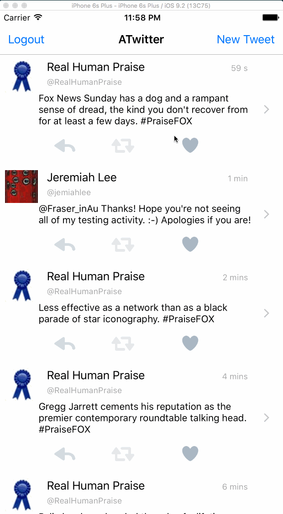

# Project 3 - ATwitter

ATwitter is a basic twitter app to read and compose tweets from the [Twitter API](https://apps.twitter.com/).

Time spent: **15** hours spent in total

## User Stories

The following **required** functionality is completed:

- [x] User can sign in using OAuth login flow.
- [x] User can view last 20 tweets from their home timeline.
- [x] The current signed in user will be persisted across restarts.
- [x] In the home timeline, user can view tweet with the user profile picture, username, tweet text, and timestamp.  In other words, design the custom cell with the proper Auto Layout settings.  You will also need to augment the model classes.
- [x] User can pull to refresh.
- [x] User can compose a new tweet by tapping on a compose button.
- [x] User can tap on a tweet to view it, with controls to retweet, favorite, and reply.

The following **optional** features are implemented:

- [x] When composing, you should have a countdown in the upper right for the tweet limit.
- [x] After creating a new tweet, a user should be able to view it in the timeline immediately without refetching the timeline from the network.
- [x] Retweeting and favoriting should increment the retweet and favorite count.
- [ ] User should be able to unretweet and unfavorite and should decrement the retweet and favorite count.
- [x] Replies should be prefixed with the username and the reply_id should be set when posting the tweet,
- [ ] User can load more tweets once they reach the bottom of the feed using infinite loading similar to the actual Twitter client.

The following **additional** features are implemented:

- [x] Almost got the decrement/increment working, but the images flip back
  and forth appropriately. Unretweet and unfavorite work as well.
- [ ] Did not get the reply button done on the first page, only on the
  detail page

Please list two areas of the assignment you'd like to **discuss further with your peers** during the next class (examples include better ways to implement something, how to extend your app in certain ways, etc):

1. Making some operations synchronous. The increment/decrement didn't
   get done because it seemed to go asynch, even though I would think
   the completion block should be executed at the end of all of that no
   matter what - it seemed to be called before the network call was even
   finished.
2. Auto-layout strategies when there are a lot of elements. I screwed
   this up and didn't have time to fix it.

## Video Walkthrough

Here's a walkthrough of implemented user stories:

GIF created with [LiceCap](http://www.cockos.com/licecap/).

## Notes

Describe any challenges encountered while building the app.

## License

    Copyright 2016 Jeremiah Lee

    Licensed under the Apache License, Version 2.0 (the "License");
    you may not use this file except in compliance with the License.
    You may obtain a copy of the License at

        http://www.apache.org/licenses/LICENSE-2.0

    Unless required by applicable law or agreed to in writing, software
    distributed under the License is distributed on an "AS IS" BASIS,
    WITHOUT WARRANTIES OR CONDITIONS OF ANY KIND, either express or implied.
    See the License for the specific language governing permissions and
    limitations under the License.
